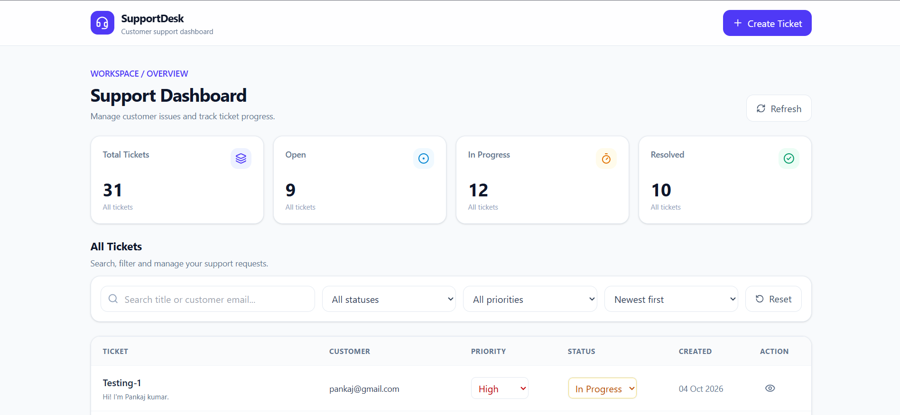

# 🎫 Support Ticket Dashboard

A full-stack customer support ticket management application built with **React, Vite, Tailwind CSS, Node.js, Express, and MongoDB**. It helps support teams create, search, filter, sort, view, and update customer support tickets through a clean, responsive dashboard.

The application includes ticket summary statistics, server-side pagination, input validation, persistent updates, and automated backend API tests.

## ✨ Features

### 📊 Dashboard
- View the total number of support tickets.
- See ticket counts grouped by status: Open, In Progress, and Resolved.
- Display tickets in a structured, easy-to-navigate interface.

### 🎟️ Ticket Management
- Create tickets with a title, customer email, description, and priority.
- Assign priorities: Low, Medium, and High.
- Manage ticket statuses: Open, In Progress, and Resolved.
- View detailed ticket information.
- Update ticket status and priority.
- Persist ticket changes in MongoDB.

### 🔎 Search, Filtering & Sorting
- Search tickets by title or customer email.
- Filter tickets by status and priority.
- Sort tickets by newest or oldest.
- Combine search, filters, sorting, and pagination.
- Load tickets using server-side pagination, with 10 tickets per page by default.

### 📱 User Experience
- Responsive interface for desktop and mobile screens.
- Loading indicators while data is being fetched.
- Empty states when no matching tickets are found.
- Error feedback for ticket operations.
- Form validation for required fields, title length, and email format.
- Reusable React components and a centralized Axios API service.

### 🧪 Backend Testing
- Automated API tests using Vitest and Supertest.
- In-memory MongoDB testing support through `mongodb-memory-server`.
- Tests covering ticket creation, email validation, combined search/filter/pagination, and persistent updates.

## 🛠️ Tech Stack

| Layer | Technologies |
|---|---|
| Frontend | React, Vite, Tailwind CSS |
| Routing | React Router |
| Icons | Lucide React |
| API communication | Axios |
| Backend | Node.js, Express |
| Database | MongoDB, Mongoose |
| Testing | Vitest, Supertest, MongoDB Memory Server |
| Development tools | ESLint, Nodemon |

## 📁 Project Structure

```text
Support-Ticket-Dashboard/
backend/
├── scripts/
│   └── seed.js
├── src/
│   ├── config/
│   │   └── db.js
│   ├── controllers/
│   │   └── ticketController.js
│   ├── middleware/
│   │   └── errorHandler.js
│   ├── models/
│   │   └── Ticket.js
│   ├── routes/
│   │   └── ticketRoutes.js
│   ├── tests/
│   │   └── ticket.test.js
│   ├── utils/
│   │   └── httpError.js
│   ├── app.js
│   └── server.js
├── .env
└── package.json
│
├── frontend/
│   ├── public/
│   ├── src/
│   │   ├── assets/
│   │   ├── components/
│   │   │   ├── CreateTicketModal.jsx
│   │   │   ├── EmptyState.jsx
│   │   │   ├── ErrorMessage.jsx
│   │   │   ├── LoadingSpinner.jsx
│   │   │   ├── Navbar.jsx
│   │   │   ├── Pagination.jsx
│   │   │   ├── SummaryCards.jsx
│   │   │   ├── TicketCard.jsx
│   │   │   ├── TicketDetailsModal.jsx
│   │   │   ├── TicketFilters.jsx
│   │   │   └── TicketTable.jsx
│   │   ├── hooks/
│   │   │   └── useTickets.js
│   │   ├── pages/
│   │   │   └── Dashboard.jsx
│   │   ├── services/
│   │   │   └── api.js
│   │   ├── App.jsx
│   │   ├── index.css
│   │   └── main.jsx
│   ├── .env
│   ├── .env.example
│   └── package.json
│
└── README.md
```

*Note: The structure above highlights the main application files. Other configuration files and dependencies are omitted for readability.*

## ⚙️ Prerequisites

Before running the project, make sure you have:

- [Node.js](https://nodejs.org/) installed.
- npm installed (included with Node.js).
- [MongoDB](https://www.mongodb.com/) running locally or a MongoDB Atlas connection string.
- Git installed to clone the repository.

## 🚀 Getting Started

### 1. Clone the Repository

```bash
git clone https://github.com/pankajkumar1922003-ku/Customer-Support-Dashboard.git
cd Customer-Support-Dashboard
```

### 2. Configure the Backend

Open a terminal in the project root and navigate to the backend:

```bash
cd backend
npm install
```

Create a `.env` file inside the `backend` directory:

```env
PORT=5000
MONGODB_URI=mongodb://127.0.0.1:27017/support_ticket_dashboard
CLIENT_URL=http://localhost:5173
```

**Environment variables**

| Variable | Description | Example |
|---|---|---|
| `PORT` | Port on which the backend server runs | `5000` |
| `MONGODB_URI` | MongoDB connection string | `mongodb://127.0.0.1:27017/support_ticket_dashboard` |
| `CLIENT_URL` | Frontend origin allowed by CORS | `http://localhost:5173` |

If you are using MongoDB Atlas, replace the local MongoDB URI with your Atlas connection string.

Start the backend development server:

```bash
npm run dev
```

The API should be available at:

```text
http://localhost:5000
```

Check the backend health endpoint:

```text
http://localhost:5000/api/health
```

A successful response looks like:

```json
{
  "success": true,
  "message": "Support Ticket API is running"
}
```

### 3. Configure the Frontend

Open a **second terminal** from the project root:

```bash
cd frontend
npm install
```

Create or update the frontend `.env` file:

```env
VITE_API_URL=http://localhost:5000/api
```

The frontend uses this variable to communicate with the backend API.

Start the frontend development server:

```bash
npm run dev
```

Open the local URL printed by Vite, typically:

```text
http://localhost:5173
```

Keep both the backend and frontend development servers running while using the application.

## 🌱 Seed the Database

The backend includes a seed script that inserts 30 sample support tickets with varied titles, priorities, statuses, customer emails, and timestamps.

To populate the database, open a terminal:

```bash
cd backend
npm run seed
```

**Important:** The seed script deletes existing documents from the `Ticket` collection before inserting sample data. Run it only against a disposable development or test database. Do not run it against production or any database containing data you want to preserve.

## 🔌 API Documentation

Base URL:

```text
http://localhost:5000/api
```

### Available Endpoints

| Method | Endpoint | Description |
|---|---|---|
| GET | `/api/health` | Check API health |
| GET | `/api/tickets` | Retrieve tickets |
| POST | `/api/tickets` | Create a ticket |
| GET | `/api/tickets/summary` | Retrieve ticket summary counts |
| GET | `/api/tickets/:id` | Retrieve a ticket by ID |
| PATCH | `/api/tickets/:id` | Update ticket status or priority |

### Search, Filter, Sort & Pagination

The ticket listing endpoint supports query parameters:

| Parameter | Description | Example |
|---|---|---|
| `search` | Search by title or customer email | `search=payment` |
| `status` | Filter by ticket status | `status=Open` |
| `priority` | Filter by priority | `priority=High` |
| `sort` | Sort by creation date | `sort=newest` |
| `page` | Page number | `page=1` |
| `limit` | Number of tickets per page | `limit=10` |

Example request:

```http
GET /api/tickets?search=payment&status=Open&priority=High&sort=newest&page=1&limit=10
```

Search, filters, sorting, and pagination are processed on the backend. Pagination metadata is returned alongside the ticket list.

### Example: Create a Ticket

**Request**

```http
POST /api/tickets
Content-Type: application/json
```

```json
{
  "title": "Unable to complete payment",
  "description": "The customer receives an error when attempting to pay.",
  "customerEmail": "customer@example.com",
  "priority": "High"
}
```

New tickets default to the `Open` status when a status is not supplied.

### Example: Update a Ticket

**Request**

```http
PATCH /api/tickets/TICKET_ID
Content-Type: application/json
```

```json
{
  "status": "In Progress",
  "priority": "High"
}
```

Replace `TICKET_ID` with an actual ticket ID returned by the API. Updates support the `status` and `priority` fields.

### Ticket Fields

| Field | Description |
|---|---|
| `title` | Required ticket title, maximum 120 characters |
| `description` | Required description of the issue |
| `customerEmail` | Required customer email address |
| `priority` | `Low`, `Medium`, or `High`; defaults to `Medium` |
| `status` | `Open`, `In Progress`, or `Resolved`; defaults to `Open` |
| `createdAt` | Creation timestamp |
| `updatedAt` | Last update timestamp |

## 🧪 Running Tests

The backend test suite uses Vitest and Supertest, with MongoDB Memory Server supporting isolated database tests.

Run the backend tests:

```bash
cd backend
npm test
```

### Verified Test Results

The backend test suite was executed successfully with the following result:

```text
Test Files  1 passed (1)
Tests       4 passed (4)
```

The four tests cover:

1. Creating a ticket with the default `Open` status.
2. Rejecting an invalid email address.
3. Combining search, filters, and pagination.
4. Persisting status and priority updates.

The test run also produced a Mongoose deprecation warning related to the `new` option in `findOneAndUpdate()`. The tests passed, but the warning can be addressed in a future cleanup.

### Frontend Scripts

Run these commands from the `frontend` directory:

```bash
npm run dev
npm run build
npm run lint
npm run preview
```

- `npm run dev` starts the Vite development server.
- `npm run build` creates a production build.
- `npm run lint` runs ESLint.
- `npm run preview` previews a production build.

## 🏗️ Technical Decisions

- **React components:** The interface is divided into reusable components for ticket cards, tables, filters, pagination, summary cards, and modals.
- **Custom hook:** `useTickets` centralizes ticket data fetching, filter state, pagination, summary loading, and ticket updates.
- **Centralized API service:** Axios requests are managed through a shared API module, keeping HTTP communication separate from UI components.
- **Server-side pagination:** The backend returns only the requested page of tickets, along with pagination metadata.
- **MongoDB and Mongoose:** Ticket data is stored persistently and validated using the ticket schema and backend validation logic.
- **Express middleware:** Centralized error handling provides consistent API error responses.
- **Automated backend tests:** Vitest and Supertest verify key API behaviours without relying on a persistent development database for every test.

## 📌 Assumptions & Limitations

- The application is designed as a support ticket dashboard, not a complete customer support platform.
- Authentication, authorization, and role-based access control are not included.
- Ticket status and priority can be updated; editing the ticket title, description, or customer email is not supported by the update endpoint.
- Search covers ticket titles and customer email addresses, not ticket descriptions.
- The backend test suite currently contains four verified tests; it does not represent exhaustive coverage of every endpoint and edge case.
- The application requires a reachable MongoDB database for normal backend operation.
- The seed script is destructive to existing documents in the target ticket collection and should be used only with disposable data.

## 📸 Screenshots

Add screenshots of your actual running application to a `screenshots/` directory in the repository, then replace or complete the entries below.

| Dashboard | Create Ticket |
|---|---|
| `screenshots/dashboard.png` | `screenshots/create-ticket.png` |
| Ticket listing, summary cards, and filters | Ticket creation form and validation |

| Ticket Details | Mobile View |
|---|---|
| `screenshots/ticket-details.png` | `screenshots/mobile-view.png` |
| Ticket information and update controls | Responsive layout on a smaller screen |

To display a screenshot directly in this README after adding the file, use:

```md

```

## 🔮 Future Improvements

- Add authentication and role-based permissions.
- Expand automated test coverage for validation, error handling, and edge cases.
- Add ticket editing and deletion with appropriate permissions.
- Improve accessibility and keyboard navigation.
- Add deployment configuration and production monitoring.

## 👨‍💻 Author

**Pankaj Kumar**

- GitHub: [@pankajkumar1922003-ku](https://github.com/pankajkumar1922003-ku)
- Repository: [Customer-Support-Dashboard](https://github.com/pankajkumar1922003-ku/Customer-Support-Dashboard)

---

If you find this project useful, consider giving the repository a ⭐ on GitHub.
