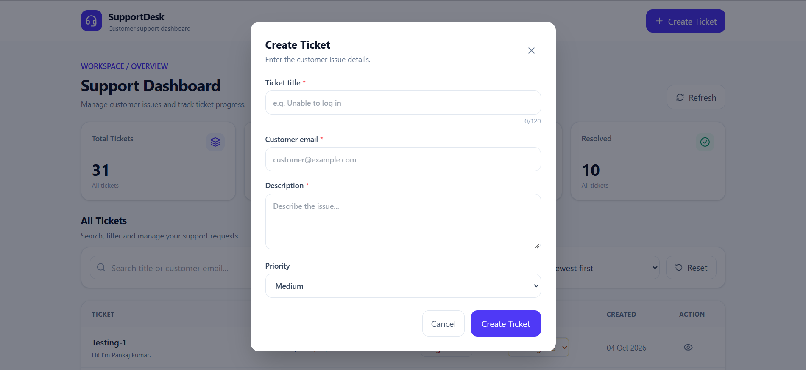
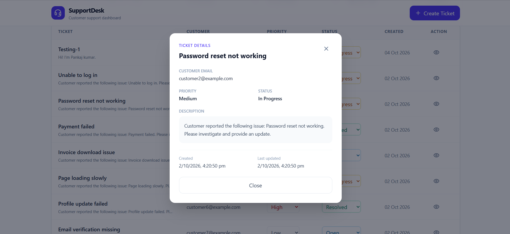
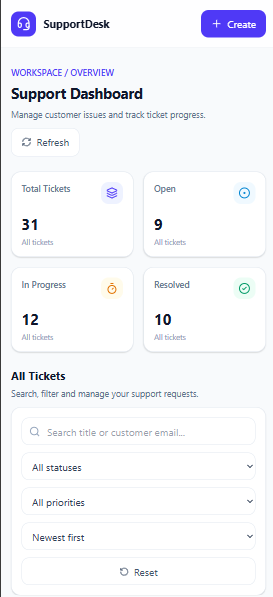

# Support Ticket Dashboard

A full-stack **Support Ticket Dashboard** built with the MERN stack to help support teams create, track, search, filter, and manage customer support requests through a responsive web interface.

The application provides ticket lifecycle management, server-side filtering and pagination, dashboard summary counts, and persistent ticket updates.

### Dashboard Overview


### Create a Ticket



### Ticket Details and Updates



### Responsive Mobile View



## Features

### Ticket Management
- Create tickets with a title, description, customer email, and priority.
- Validate required fields and customer email format.
- Enforce a maximum title length of 120 characters.
- Automatically assign the default status `Open`.
- Track ticket statuses: `Open`, `In Progress`, and `Resolved`.
- Set ticket priorities: `Low`, `Medium`, and `High`.
- View complete ticket details.
- Update ticket status and priority.
- Persist changes in the database.

### Search and Organization
- Search tickets by title or customer email.
- Filter tickets by status and priority.
- Sort tickets by creation date, newest or oldest first.
- Use server-side pagination with 10 tickets per page.
- Combine search, filters, sorting, and pagination.

### Dashboard and User Experience
- Display total ticket counts.
- Show counts for Open, In Progress, and Resolved tickets.
- Support desktop and mobile layouts.
- Provide loading, empty, and error states.
- Display useful validation and API error messages.

### Testing
- Automated backend tests using Vitest and Supertest.
- Isolated database testing using MongoDB Memory Server.

## Tech Stack

| Area | Technologies |
|---|---|
| Frontend | React, Vite, Tailwind CSS, Axios, Lucide React |
| Backend | Node.js, Express.js |
| Database | MongoDB, Mongoose |
| Testing | Vitest, Supertest, MongoDB Memory Server |
| Development | Git, GitHub, npm |

## Project Structure

```text
Customer-Support-Dashboard/
├── backend/
│   ├── scripts/
│   │   └── seed.js
│   ├── src/
│   │   ├── config/
│   │   │   └── db.js
│   │   ├── controllers/
│   │   │   └── ticketController.js
│   │   ├── middleware/
│   │   │   └── errorHandler.js
│   │   ├── models/
│   │   │   └── Ticket.js
│   │   ├── routes/
│   │   │   └── ticketRoutes.js
│   │   ├── tests/
│   │   │   └── ticket.test.js
│   │   ├── utils/
│   │   │   └── httpError.js
│   │   ├── app.js
│   │   └── server.js
│   ├── .env.example
│   ├── .gitignore
│   └── package.json
├── frontend/
│   ├── src/
│   │   ├── assets/
│   │   ├── components/
│   │   ├── hooks/
│   │   ├── pages/
│   │   ├── services/
│   │   │   └── api.js
│   │   ├── App.jsx
│   │   ├── index.css
│   │   └── main.jsx
│   ├── .env.example
│   ├── .gitignore
│   ├── index.html
│   ├── package.json
│   └── vite.config.js
├── screenshots/
│   ├── dashboard.png
│   ├── create-ticket.png
│   ├── ticket-details.png
│   ├── filters-and-search.png
│   └── mobile-view.png
├── .gitignore
└── README.md
```

*The structure above represents the intended project layout. Keep only files and folders that exist in your repository.*

## Prerequisites

Before running the project, install:

- [Node.js](https://nodejs.org/) and npm.
- [MongoDB Atlas](https://www.mongodb.com/atlas) or a local MongoDB instance.
- [Git](https://git-scm.com/) (optional, for cloning the repository).

## Getting Started

### 1. Clone the Repository

```bash
git clone https://github.com/pankajkumar1922003-ku/Customer-Support-Dashboard.git

cd Customer-Support-Dashboard
```

### 2. Configure the Backend

Navigate to the backend directory and install dependencies:

```bash
cd backend
npm install
```

Create a `.env` file inside the `backend/` directory.

**Backend environment variables:**

```env
PORT=5000
MONGO_URI=mongodb+srv://<username>:<password>@<cluster-url>/support_ticket_dashboard
```

Replace the placeholders with your actual MongoDB Atlas credentials and cluster details. Alternatively, use your local MongoDB connection string.

The URI above is an example format, not a working connection string.

Start the backend:

```bash
npm run dev
```

The local API base URL is expected to be:

```text
http://localhost:5000/api
```

Keep the backend terminal running.

### 3. Configure the Frontend

Open a second terminal from the project root:

```bash
cd frontend
npm install
```

Create a `.env` file inside the `frontend/` directory.

**Frontend environment variables:**

```env
VITE_API_URL=http://localhost:5000/api
```

Start the frontend:

```bash
npm run dev
```

Open the local URL displayed in the terminal. With the default Vite configuration, it is usually:

```text
http://localhost:5173
```

**Important:** If you change an environment variable, restart the corresponding development server.

## Environment Variables Reference

| Variable | Location | Description |
|---|---|---|
| `PORT` | `backend/.env` | Port used by the backend server |
| `MONGO_URI` | `backend/.env` | MongoDB connection string |
| `VITE_API_URL` | `frontend/.env` | Base URL of the backend API |

Never put MongoDB credentials in frontend environment variables. Variables prefixed with `VITE_` are exposed to the browser.

## API Documentation

The default local API base URL is:

```text
http://localhost:5000/api
```

### Endpoints

| Method | Endpoint | Description |
|---|---|---|
| `GET` | `/tickets` | Retrieve tickets with search, filters, sorting, and pagination |
| `GET` | `/tickets/summary` | Retrieve total ticket count and status counts |
| `POST` | `/tickets` | Create a ticket |
| `GET` | `/tickets/:id` | Retrieve an individual ticket, if implemented |
| `PATCH` | `/tickets/:id` | Update ticket status and/or priority |

### Ticket List Query Parameters

| Parameter | Example | Description |
|---|---|---|
| `page` | `page=1` | Page number |
| `limit` | `limit=10` | Number of tickets per page |
| `search` | `search=Login` | Search by title or customer email |
| `status` | `status=Open` | Filter by ticket status |
| `priority` | `priority=High` | Filter by ticket priority |
| `sort` | `sort=newest` | Sort by creation date |

Supported sort values are `newest` and `oldest`.

Example request:

```http
GET /api/tickets?page=1&limit=10&sort=newest
```

Filters and search parameters can be combined, subject to the backend implementation.

### Create Ticket Example

Request body:

```json
{
  "title": "Login issue",
  "description": "Customer is unable to log in to the dashboard.",
  "customerEmail": "rahul@example.com",
  "priority": "High"
}
```

The status defaults to `Open` when omitted.

### Update Ticket Example

Request body:

```json
{
  "status": "In Progress",
  "priority": "Medium"
}
```

The API should validate the supplied fields and return appropriate HTTP status codes and error responses.

## Data Model

A support ticket contains the following fields:

| Field | Description |
|---|---|
| `title` | Required; maximum 120 characters |
| `description` | Required ticket description |
| `customerEmail` | Required; valid email address |
| `priority` | Low, Medium, or High |
| `status` | Open, In Progress, or Resolved; defaults to Open |
| `createdAt` | Automatically generated creation timestamp |
| `updatedAt` | Automatically generated update timestamp |

Mongoose timestamps are used to maintain creation and update times.

## Seed Sample Data

The backend includes a seed script for generating sample tickets.

From the backend directory, run:

```bash
npm run seed
```

Check `backend/package.json` for the available script and confirm that the seed data contains at least 25 tickets with varied statuses and priorities.

**Warning:** The current seed script uses `Ticket.deleteMany({})` before inserting sample records. This can delete existing tickets from the configured collection. Run it only against a disposable development database, never against production data.

## Running Tests

From the backend directory, install dependencies and run:

```bash
npm test
```

The project uses Vitest and Supertest for automated tests, with MongoDB Memory Server for isolated database testing.

Review the test results and ensure that at least three meaningful automated tests cover areas such as:

- Ticket input validation.
- Ticket search, filtering, or querying.
- Ticket status or priority updates.

Refer to `backend/package.json` for the actual test scripts configured in the project.

## Technical Decisions

- **React and Vite:** Provide a component-based frontend and development workflow.
- **Tailwind CSS:** Supports responsive layouts and reusable styling.
- **Node.js and Express.js:** Handle API requests and backend business logic.
- **MongoDB and Mongoose:** Provide persistent storage and structured data validation.
- **Vitest and Supertest:** Support automated API testing.
- **MongoDB Memory Server:** Allows tests to run against an isolated database.

These choices keep the frontend, API, and database responsibilities separated and make the codebase easier to maintain.

## Assumptions

- Authentication and role-based access control are outside the assignment scope.
- Tickets use the predefined status and priority values.
- Each ticket must include a title, description, and valid customer email.
- Search, filtering, sorting, and pagination are handled by the backend.
- Dashboard summary counts represent the full dataset rather than only the currently filtered results.

## Known Limitations

- The application does not include authentication or role-based access control.
- The documented local setup assumes the backend runs on port `5000` and the frontend uses port `5173`, unless configured otherwise.
- A production deployment is not required by the assignment.
- Add any other known limitations based on the final implementation and testing results.

## Troubleshooting

**Frontend cannot reach the API**
- Confirm the backend server is running.
- Verify that `VITE_API_URL` matches the backend API base URL.
- Check the browser console and backend terminal for errors.

**MongoDB connection fails**
- Verify the `MONGO_URI` value.
- Check your database username and password.
- Confirm the Atlas database user's permissions and network access settings.

**Tickets are not displayed**
- Check that the database contains ticket documents.
- Test `GET /api/tickets?page=1&limit=10&sort=newest`.
- Inspect the backend response and browser console.

**Dashboard summary counts are incorrect**
- Test `GET /api/tickets/summary`.
- Ensure summary counts are calculated across the complete dataset.

**CORS errors**
- Verify that the backend CORS configuration permits requests from the frontend origin.

**Environment changes do not apply**
- Restart the relevant development server after changing `.env`.

**Tests fail**
- Check installed dependencies, the test script, and MongoDB Memory Server setup.
- Review the test output to identify the failing assertion or database error.

## Security Notes

- Keep actual credentials in local `.env` files.
- Never commit real `.env` files to GitHub.
- Never expose MongoDB connection strings in frontend code.
- Use a database user with only the permissions required by the application.
- Restrict MongoDB network access where possible.
- Rotate credentials immediately if they have been exposed publicly.

## AI Assistance

AI tools were used for development guidance, debugging assistance, frontend/backend integration support, and documentation drafting. The implementation and API behavior should be reviewed and tested by the author, who should be able to explain and modify the submitted code.

## Author

**Pankaj Kumar**

- GitHub: [pankajkumar1922003-ku](https://github.com/pankajkumar1922003-ku)
- Repository: [Customer Support Dashboard](https://github.com/pankajkumar1922003-ku/Customer-Support-Dashboard)

---

Built as part of a Full-Stack Web Application Developer technical assignment.
